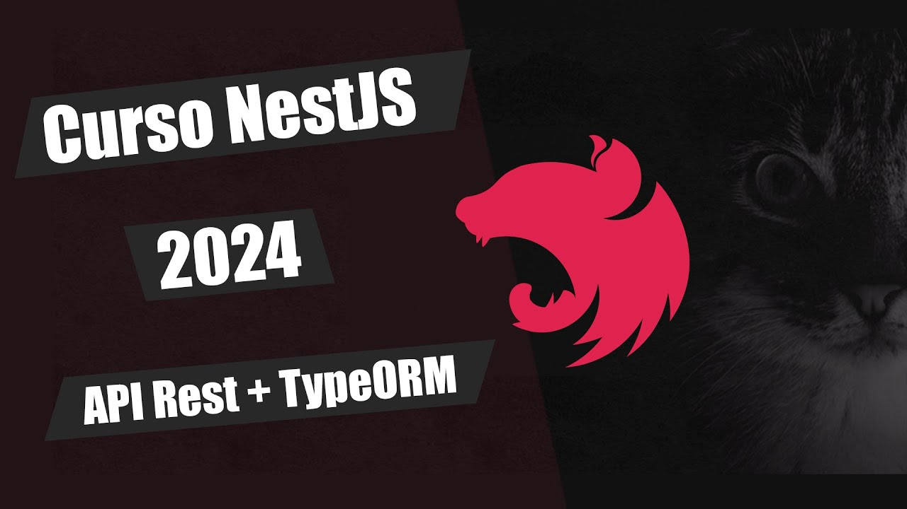

  

# CURSO DE NEST.JS / API REST / TypeORM
Este é um curso de Nest.js realizado pelo **[Deyvisson Breno Veras](https://github.com/deyvissonbrenoveras)**, Application Development Senior Analyst na Accenture Brasil. Estou estudando e praticando este curso para aprimorar meus conhecimentos no mundo do back-end e api.

## SKILLS ADQUIRIDAS
- **[NEST.js](https://nestjs.com/)**
- API REST
- TypeORM